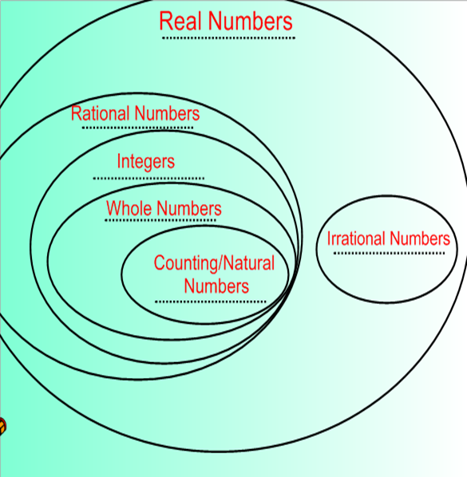

 | Name      | Symbol |   Description |
| ----------- | ----------- | -------|
| Natural numbers | N      | The counting numbers {1,2,3,…} |
| Whole numbers   | W        | The natural numbers, plus zero:  {0,1,2,3,…} |
| Integers   | Z        | All numbers that can be written without a fractional part, the natural numbers in addition to 0  and the negative numbers, {…−3,−2,−1,0,1,2,3,…} |
| Rational Numbers   | Q       | All numbers that can be written as a __ratio__ or __quotient__ of two integers, the integers in addition to all fractions |
| Irrational Numbers  | none       | All number that cannot be written as a ratio of two integers. For example, π and square root of 2 are irrational numbers |
| Real Numbers  | R       | All numbers that are either rational or irrational. |

 
 
 ## Natural Numbers "ℕ"

- A natural number is a non-negative integer that starts from 1 and continues indefinitely, used for counting and ordering objects.
- In mathematical notation, natural numbers are typically represented as N = {1, 2, 3, 4, ...}. They are the simplest and most fundamental type of numbers in mathematics.

## Whole Numbers "|W"

- Begin natural numers with 0
- 

## Integers "ℤ or zahlen"

- 

 - 1 ∈ Z ([Integer] One is an element of [a set of all integers]
 - 1 ∉ Z ([Integer] One is not an element of [a set of all integers]

## Rational Numbers "Q"

- Rational numbers are ratios or sometimes called fractions of integers
- {(a/b) | a, b ∈ Z, b ≠ 0 }
  - A over B and then I write a couple of things. This bar by the way means, such that, so the way that we have this so far is the set of all numbers A over B, such that A and B are integers. I'm allowed to pick any integer I want, two thirds, one half, three fifths, pick whatever you want as long as of course, and I think we all know this, you can't divide by zero, so __you're not allowed to pick your denominator to be zero. Any other values are fine, as long as your denominator is not zero__.
  - not every number is rational. You may know that pi cannot be written as a fraction. So we'd say of course that like pi is not rational. When you are not rational, some like this, you're called irrational, so pi is irrational.
 
 ## Real Numbers
 - any number with a decimal expansion (7.00, pi 3.14159)

## General

N (natural numbers) ⊆ (are a subset)  W (of the whole numbers) ⊆   Z ⊆ Q ⊆  R