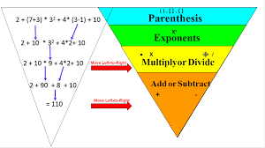
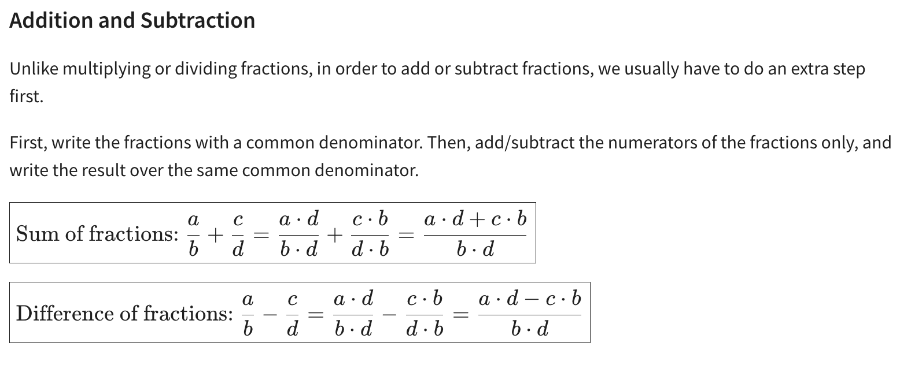
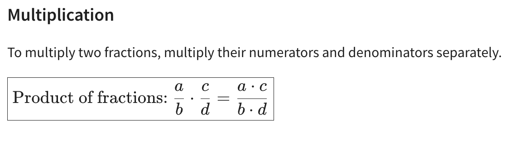
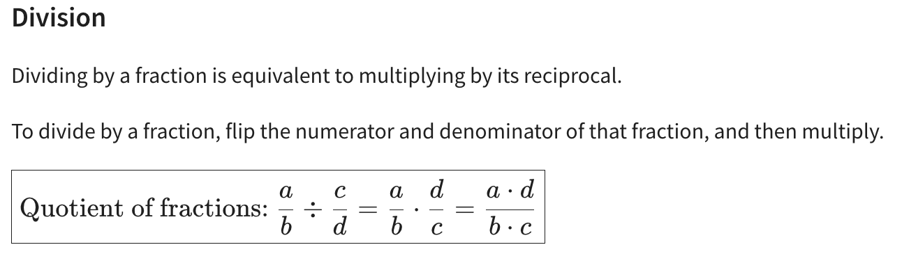

# Real Number - any number with an decimal expansion

- Repition (rational)
  - an infinite number (same decimal repeat towards infinity) such as 1/3 or 0.33333...
  - a finite number (decimals do not repeat) such as 1/2 or 0.50

- No repition (irational): (the decimals that no not repeat)
  - such as pi 3.141519...
  - e = 2.718...
 
## Square Roots

- Square root of a, denote as √a, is the non-negative number b ∈ R that b**2 = a
- Square roots are positive numbers
- Square root of 0, √0, is allowed - √0 = 0

## Order of Operations

## Properties w/ Real Numbers

###  __Closure Property__:
  - If a and b are any real numbers: a,b ∈ R ( a and b are elements of R). Then the set of real numbers is closed with respect to addition and multiplication
    - So a + b is always a real number, and a * b is always a real number, and
    - let a,b ∈ R - then a + b ∈ R, a*b ∈ R 

### Communitive Property
- when the order of operations on real numbers does not matter
  - a + b = b + a
  - a * b = b * a
- subtraction is not communicative
  -  2 - 3 ≠ 3 - 2  (-1 ≠ 1)
- division is not communicative

### Associative Properties
 -  The associative property is a fundamental concept in mathematics, particularly in the context of arithmetic and algebra. It refers to the property of how operations (such as addition and multiplication) can be grouped without changing the result. The associative property states that for a given set of elements and a specific operation, the grouping of those elements does not affect the final outcome.

  - There are two forms of the associative property:

    - __Associative Property of Addition__: This property states that when you add three or more numbers, the way you group them does not affect the sum. In symbolic terms, for any numbers a, b, and c:
      - (a + b) + c = a + (b + c)
      - For example, (2 + 3) + 4 is equal to 2 + (3 + 4), and both equal 9.

    - __Associative Property of Multiplication__: This property states that when you multiply three or more numbers, the way you group them does not affect the product. In symbolic terms, for any numbers a, b, and c:

      - (a * b) * c = a * (b * c)
      - For example, (2 * 3) * 4 is equal to 2 * (3 * 4), and both equal 24.

- Subtraction and Division are not communicative  

### Identies Property
   - Addition
     - Add a to 0, the answer will be a
     - Multiple a * 1, the answer will be a  

### Distribution Property
- The distributive property is a fundamental property in mathematics that describes how multiplication interacts with addition or subtraction. It relates to the distribution of one operation over another. In essence, it allows you to perform an operation on two numbers separately and then combine the results. There are two main forms of the distributive property:

  - __Distributive Property of Multiplication over Addition__:
    - This form of the distributive property states that when you multiply a number by the sum of two other numbers, you can distribute the multiplication to each of the numbers inside the parentheses. In symbolic terms, for any numbers a, b, and c:
    - a * (b + c) = (a * b) + (a * c)
    - For example, if you have 2 * (3 + 4), you can distribute the multiplication, resulting in (2 * 3) + (2 * 4), which equals 6 + 8, or 14.

  - __Distributive Property of Multiplication over Subtraction__:
    - Similarly, this form of the distributive property states that when you multiply a number by the difference of two other numbers, you can distribute the multiplication to each of the numbers inside the parentheses. In symbolic terms, for any numbers a, b, and c:
    - (a * (b - c) = (a * b) - (a * c)
    - For example, if you have 2 * (5 - 3), you can distribute the multiplication, resulting in (2 * 5) - (2 * 3), which equals 10 - 6, or 4. 

## Bowties Method for Substracting and Adding Fractions

1. Multiply top left numerator w/ bottom right denominator
2. That number is the 1st new numerator component
3. In the new numerator carry over the +/- from the old fraction
4. Repeat steps 1 and 2 for the inverse
5. Multiple the denominator - they will become the denominator of the new fraction

Ex. Add:  1/2 + 3/5 -> ((1*5) + (3*2)) / (2*5) => (5 + 6) / 10 => 11/10

Ex: Substract: 4/3 - 1/8 => ((4*8) - (1*3)) / (3*8) => (32 - 3)/24 => 29/24

## Horizontal Method for Multiplying Fractions
1. Multiple the numerators
2. Multiple the denominator

## Horizontal Method for Dividing Fractions
1. (a/b) / (c/d)
2. (a/b) * (d/c)
3. (a*d)/ (b*c)

